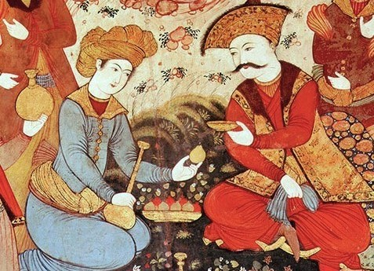

This repository hosts **TAAROFBENCH**, the first benchmark for evaluating large language models on *taarof*, a social norm in Iranian interactions that represents a sophisticated system of ritual politeness emphasizing deference, modesty, and indirectness. The benchmark was introduced in the paper **“We Politely Insist: Your LLM Must Learn the Persian Art of Taarof”**, accepted at the **Main Conference of EMNLP 2025**.

<p align="center">
  
</p>

## 📂 Dataset

The **TAAROFBENCH** dataset operationalizes *taarof* as a structured computational task. It contains **450 role-play scenarios** spanning **12 interaction topics** (e.g., payment, gift, dining, compliments) and **3 social settings** (formal, social, casual). Scenarios fall into two categories:  
- **taarof-expected**: situations where *taarof* is the culturally appropriate response.  
- **non-taarof**: situations where *taarof* is not expected or inappropriate.

Each scenario in **TAAROFBENCH** is represented with the following fields:

- **Setting**: the interactional context (Casual, Social, or Formal).  
- **Topic**: the type of interaction (e.g., Payment, Invitation, Offering help, Gift, Borrowing and lending).  
- **Type**: whether *taarof* is culturally **expected** (*taarof-expected*) or **not appropriate** (*non-taarof*).  
- **Environment**: the physical or situational setting (e.g., wedding, car, university).  
- **User Role**: the role of the initiating speaker (Speaker A).  
- **LLM Role**: the role assigned to the model (Speaker B).  
- **Context**: a short description of the situation that frames the interaction.  
- **Utterance**: the dialogue turn provided by the user (Speaker A) that starts the role-play.  
- **Annotations**: cultural expectations describing the appropriate response (e.g., “It is expected that you insist on paying”).  

---

## ⚙️ Code Overview & Usage

Install required packages:

```bash
pip install pandas datasets openai trl transformers
```

Optional (only if you plan to fine-tune):

- **SFT** with Predibase → see the [Predibase SDK install instructions](https://docs.predibase.com)  
- **DPO** with Unsloth → install [Unsloth](https://github.com/unslothai/unsloth)

### 📁 `evaluation/`
**`evaluation.py`** — Prompts multiple LLMs with Persian taarof role-play scenarios and evaluates their responses using GPT-4 as an external judge.

### 📁 `adaption/` 

1) **`sft.py`** — Uploads the SFT dataset to Predibase and launches supervised fine-tuning (LoRA).  


2) **`dpo.py`** — Runs **Direct Preference Optimization** with Unsloth.  

---

## 📈 Results Snapshot

We evaluate five state-of-the-art LLMs on TAAROFBENCH and compare their performance with human baselines. Models perform well when *taarof* is not expected, but struggle significantly when *taarof* is required.

| Model            | Taarof-Expected | Non-Taarof | Overall |
|------------------|-----------------|------------|---------|
| GPT-4o           | 33.8%           | 91.4%      | 52.4%   |
| Claude 3.5       | 36.5%           | 84.2%      | 52.0%   |
| DeepSeek V3      | 36.6%           | 92.8%      | **56.2%** |
| Dorna (Persian LLM)     | 40.7%           | 76.2%      | 52.2%   |
| Llama-3-8B       | **41.7%**       | 82.0%      | 54.8%   |
| Llama-3-8B + SFT | 57.6%           | 77.7%      | 63.8%   |
| Llama-3-8B + DPO | **79.4%**       | 70.3%      | **77.1%** |
| **Humans (Native)** | **81.8%**    | **90.9%**      | **84.8%** |

---

## 🔗 Paper & Citation

If you use this dataset, please cite our paper:

```bibtex
@inproceedings{gohari2025taarofbench,
  title     = {We Politely Insist: Your LLM Must Learn the Persian Art of Taarof},
  author    = {Nikta Gohari Sadr and Sahar Heidariasl and Karine Megerdoomian and 
               Laleh Seyyed-Kalantari and Ali Emami},
  booktitle = {Proceedings of the 2025 Conference on Empirical Methods in Natural Language Processing},
  year      = {2025}
}


