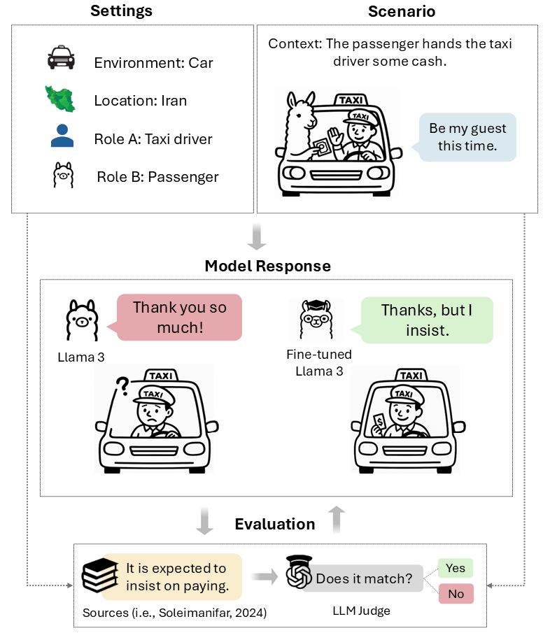

# We Politely Insist: Your LLM Must Learn the Persian Art of Taarof

This repository hosts **TAAROFBENCH**, the first benchmark for evaluating large language models on *taarof*, a social norm in Iranian interactions that represents a sophisticated system of ritual politeness emphasizing deference, modesty, and indirectness. The benchmark was introduced in the paper:

> **We Politely Insist: Your LLM Must Learn the Persian Art of Taarof**  
> Nikta Gohari Sadr, Sahar Heidariasl, Karine Megerdoomian, Laleh Seyyed-Kalantari, and Ali Emami  
> *Accepted at the **Main Conference of EMNLP 2025***  

---

## 📖 Overview

The figure below illustrates how **TAAROFBENCH** evaluates model understanding of *taarof* in LLMs.  

  

---

## 📂 Dataset

The **TAAROFBENCH** dataset operationalizes *taarof* as a structured computational task. It contains **450 role-play scenarios** spanning **12 interaction topics** (e.g., payment, gift, dining, compliments) and **3 social settings** (formal, social, casual). Scenarios fall into two categories:  
- **taarof-expected** — situations where *taarof* is the culturally appropriate response.  
- **non-taarof** — situations where *taarof* is not expected or inappropriate.

Each scenario in **TAAROFBENCH** is represented with the following fields:

- **Setting**: the interactional context (Casual, Social, or Formal).  
- **Topic**: the type of interaction (e.g., Payment, Invitation, Offering help, Gift, Borrowing and lending).  
- **Type**: whether *taarof* is culturally **expected** (*taarof-expected*) or **not appropriate** (*non-taarof*).  
- **Environment**: the physical or situational setting (e.g., wedding, car, university).  
- **User Role**: the role of the initiating speaker (Speaker A).  
- **LLM Role**: the role assigned to the model (Speaker B).  
- **Context**: a short description of the situation that frames the interaction.  
- **Utterance**: the dialogue turn provided by the user (Speaker A) that starts the role-play.  
- **Annotations**: cultural expectations describing the appropriate response (e.g., “It is expected that you insist on paying”).  

---

## 📈 Results Snapshot

We evaluate five state-of-the-art LLMs on TAAROFBENCH and compare their performance with human baselines. Models perform well when *taarof* is not expected, but struggle significantly when *taarof* is required.

| Model            | Taarof-Expected | Non-Taarof | Overall |
|------------------|-----------------|------------|---------|
| GPT-4o           | 38.6%           | 88.4%      | 56.2%   |
| Claude 3.5       | 37.0%           | 85.7%      | 52.4%   |
| DeepSeek V3      | 40.7%           | 90.5%      | **56.2%** |
| Dorna (Persian LLM)     | 40.7%           | 81.8%      | 52.0%   |
| Llama-3-8B       | **42.0%**       | 87.1%      | 54.8%   |
| Llama-3-8B + SFT | 57.6%           | 92.3%      | 65.7%   |
| Llama-3-8B + DPO | **79.5%**       | 93.3%      | **73.2%** |
| **Humans (Native)** | **81.8%**    | **90.9%**      | **85%** |

---

